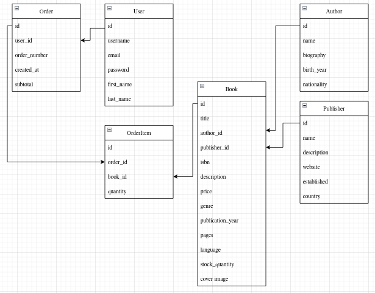

# BookStore

## Description

A RESTful API for an online bookstore that provides comprehensive book management, user authentication, and order processing functionality. The system allows users to browse books, filter by various criteria, manage shopping carts, and track order history.

## Features

- Book catalog with advanced search and filtering
- Author and publisher management
- User authentication and authorization
- Shopping cart functionality
- Order management
- User profiles with order history

## API Endpoints

### Authentication

#### Register User
- **POST** `/api/auth/register`
- **Description**: Create a new user account
- **Request Body**:
```json
{
  "username": "string",
  "email": "string",
  "password": "string",
  "confirm_password": "string"
}
```
- **Response**: `201 Created`
```json
{
  "user": {
  "id": 1,
  "username": "string",
  "email": "string",
  },
  "refresh_token": "string",
  "access_token": "string"
}
```

#### Login
- **POST** `/api/auth/login`
- **Description**: Authenticate user and receive JWT tokens
- **Request Body**:
```json
{
  "username": "string",
  "password": "string"
}
```
- **Response**: `200 OK`
```json
{
  "refresh_token": "string",
  "access_token": "string"
}
```

#### Logout
- **POST** `/api/auth/logout`
- **Description**: Invalidate user token
- **Headers**: `Authorization: Bearer <access_token>`
- **Request body**:
```json
{
  "refresh_token: "string"
}
```
- **Response**: `200 OK`

### Books

#### List Books
- **GET** `/api/books`
- **Description**: Get paginated list of books with filtering and sorting
- **Authentication**: Not required
- **Query Parameters**:
  - `search` (string): Search by title or author name
  - `genre` (string): Filter by genre
  - `publisher` (integer): Filter by publisher ID
  - `min_price` (decimal): Minimum price filter
  - `max_price` (decimal): Maximum price filter
  - `ordering` (string): Sort by `price`, `-price`, `genre`
  - `page` (integer): Page number
  - `limit` (integer): Items per page
- **Response**: `200 OK`
```json
{
  "count": 100,
  "next": "http://api/books?page=2",
  "previous": null,
  "results": [
    {
      "id": 1,
      "title": "string",
      "author": {
        "id": 1,
        "name": "string",
        "href": "/api/authors/1"
      },
      "price": 0.5,
      "genre": "string",
      "cover_image": "url"
    }
  ]
}
```

#### Get Book Details
- **GET** `/api/books/{id}`
- **Description**: Get detailed information about a specific book
- **Authentication**: Not required
- **Response**: `200 OK`
```json
{
  "id": 1,
  "title": "string",
  "author": {
    "id": 1,
    "name": "string",
    "biography": "string"
  },
  "publisher": {
    "id": 1,
    "name": "string"
  },
  "isbn": "string",
  "description": "string",
  "price": 32.1,
  "genre": "string",
  "publication_year": 2013,
  "pages": 363,
  "language": "string",
  "stock_quantity": 10,
  "cover_image": "url"
}
```
- **Error response**: `404 Not Found`

#### Create Book
- **POST** `/api/books`
- **Description**: Add a new book to the catalog
- **Authentication**: Required (admin only)
- **Headers**: `Authorization: Bearer <admin_access_token>`
- **Request Body**:
```json
{
  "title": "string",
  "author_id": 1,
  "publisher_id": 1,
  "isbn": "string",
  "description": "string",
  "price": 19.99,
  "genre": "string",
  "publication_year": 2020,
  "pages": 332,
  "language": "string",
  "stock_quantity": 12
}
```
- **Response**: `201 Created`
```json
{
  "id": 1,
  "title": "string",
  "author": {
    "id": 1,
    "name": "string",
    "href": "/api/authors/1"
  },
  "publisher": {
    "id": 1,
    "name": "string",
    "href": "/api/publishers/1"
  },
  "isbn": "string",
  "price": 19.99,
  "genre": "string",
  "publication_year": 2020,
  "pages": 332,
  "language": "string",
  "stock_quantity": 12
}
```
- **Error Responses**: 
  - `400 Bad Request`
  - `401 Unauthorized`
  - `403 Forbidden`
  - `409 Conflict`

#### Update Book
- **PUT** `/api/books/{id}`
- **Description**: Update book information
- **Authentication**: Required (admin only)
- **Headers**: `Authorization: Bearer <admin_access_token>`
- **Request Body**: Same as Create Book
- **Response**: `200 OK`
- **Error Responses**: 
  - `400 Bad Request`
  - `401 Unauthorized`
  - `403 Forbidden`
  - `404 Not Found`

#### Delete Book
- **DELETE** `/api/books/{id}`
- **Description**: Remove book from catalog
- **Authentication**: Required (admin only)
- **Headers**: `Authorization: Bearer <admin_access_token>`
- **Response**: `204 No Content`
- **Error Responses**: 
  - `401 Unauthorized`
  - `403 Forbidden`
  - `404 Not Found`


### Authors

#### List Authors
- **GET** `/api/authors`
- **Description**: Get list of all authors
- **Authentication**: Not required
- **Response**: `200 OK`
```json
[
  {
    "id": 1,
    "name": "string",
    "biography": "string",
    "birth_year": 1992,
    "nationality": "string"
  }
]
```

#### Get Author Details
- **GET** `/api/authors/{id}`
- **Description**: Get author details with their books
- **Authentication**: Not required
- **Response**: `200 OK`
```json
{
  "id": 1,
  "name": "string",
  "biography": "string",
  "birth_year": 1913,
  "nationality": "string",
  "books": [
    {
      "id": 1,
      "title": "string",
      "price": 2.0,
      "genre": "string"
    }
  ]
}
```
- **Error response**: `404 Not Found`

#### Create Author
- **POST** `/api/authors`
- **Authentication**: Required (admin only)
- **Headers**: `Authorization: Bearer <admin_access_token>`
- **Request Body**:
```json
{
  "name": "string",
  "biography": "string",
  "birth_year": 2000,
  "nationality": "string"
}
```
- **Response**: `201 Created`
```json
{
  "id": 1,
  "name": "string",
  "biography": "string",
  "birth_year": 2000,
  "nationality": "string"
}
```
- **Error responses**:
  - `400 Bad Request`
  - `401 Unauthorized`
  - `403 Forbidden`

#### Update Author
- **PUT** `/api/authors/{id}`
- **Authentication**: Required (admin only)
- **Headers**: `Authorization: Token <admin_access_token>`
- **Request Body**: Same as Create Author
- **Response**: `200 OK`
- **Error responses**:
  - `400 Bad Request`
  - `401 Unauthorized`
  - `403 Forbidden`
  - `404 Not Found`

#### Delete Author
- **DELETE** `/api/authors/{id}`
- **Authentication**: Required (admin only)
- **Headers**: `Authorization: Token <admin_access_token>`
- **Response**: `204 No Content`
- **Error responses**: `400 Bad Request`
```json
{
  "error": "Cannot delete author with existing books. Please remove or reassign all books first."
}
```
  - `401 Unauthorized`
  - `403 Forbidden`
  - `404 Not Found`

### Publishers

#### List Publishers
- **GET** `/api/publishers`
- **Description**: Get list of all publishers
- **Authentication**: Not required
- **Response**: `200 OK`
```json
[
  {
    "id": 1,
    "name": "string",
    "description": "string",
    "website": "string"
  }
]
```

#### Get Publisher Details
- **GET** `/api/publishers/{id}`
- **Description**: Get publisher details
- **Authentication**: Not required
- **Response**: `200 OK`
```json
{
  "id": 1,
  "name": "string",
  "description": "string",
  "website": "string",
  "established": 1995,
  "country": "string"
}
```
- **Error response**: `404 Not Found`

#### Get Publisher's Books
- **GET** `/api/publishers/{id}/books`
- **Description**: Get paginated list of books by publisher
- **Authentication**: Not required
- **Query Parameters**: Same as List Books endpoint
- **Response**: `200 OK` (same structure as List Books)
- **Error response**: `404 Not Found`

#### Create Publisher
- **POST** `/api/publishers`
- **Authentication**: Required (admin only)
- **Headers**: `Authorization: Bearer <admin_access_token>`
- **Request Body**:
```json
{
  "name": "string",
  "description": "string",
  "website": "string",
  "enstablished": 1995,
  "country": "string"
}
```
- **Response**: `201 Created`
```json
{
  "id": 1,
  "name": "string",
  "description": "string",
  "website": "string",
  "established": 1995,
  "country": "string"
}
```
- **Error responses**:
  - `400 Bad Request`
  - `401 Unauthorized`
  - `403 Forbidden`

#### Update Publisher 
- **PUT** `/api/publishers/{id}`
- **Authentication**: Required (admin only)
- **Headers**: `Authorization: Token <admin_access_token>`
- **Request Body**: Same as Create Publisher
- **Response**: `200 OK`
- **Error responses**:
  - `400 Bad Request`
  - `401 Unauthorized`
  - `403 Forbidden`
  - `404 Not Found`

#### Delete Publisher
- **DELETE** `/api/publishers/{id}`
- **Authentication**: Required (admin only)
- **Headers**: `Authorization: Token <admin_access_token>`
- **Response**: `204 No Content`
- **Error responses**: `400 Bad Request`
```json
{
  "error": "Cannot delete publisher with existing books. Please remove or reassign all books first."
}
```
  - `401 Unauthorized`
  - `403 Forbidden`
  - `404 Not Found`

### Shopping Cart

#### Get Cart
- **GET** `/api/cart`
- **Description**: Get current user's cart
- **Authentication**: Not required
- **Headers**: `Authorization: Bearer <access_token>`
- **Response**: `200 OK`
```json
{
  "id": 1,
  "items": [
    {
      "id": 1,
      "book": {
        "id": 1,
        "title": "string",
        "price": 13.75
      },
      "quantity": 2,
      "subtotal": 59.98
    }
  ],
  "total": 59.98
}
```

#### Get User's Cart
- **GET** `/api/admin/users/{user_id}/cart`
- **Description**: View any user's cart (admin only)
- **Authentication**: Required (admin only)
- **Headers**: `Authorization: Bearer <admin_access_token>`
- **Response**: `200 OK`
```json
{
  "user_id": 1,
  "session_key": "string",
  "items": [
    {
      "book_id": 1,
      "book": {
        "id": 1,
        "title": "string",
        "price": 13.75
      },
      "quantity": 2,
      "subtotal": 27.50
    }
  ],
  "total_items": 2,
  "total_price": 27.50
}
```
- **Error Responses**:
  - `401 Unauthorized`
  - `403 Forbidden`
  - `404 Not Found`

#### Add to Cart
- **POST** `/api/cart/items`
- **Description**: Add book to cart
- **Authentication**: Not required
- **Headers**: `Authorization: Bearer <access_token>`
- **Request Body**:
```json
{
  "book_id": 1,
  "quantity": 2
}
```
- **Response**: `201 Created`
```json
{
  "book_id": 1,
  "book": {
    "id": 1,
    "title": "string",
    "price": 13.75
  },
  "quantity": 2,
  "subtotal": 27.50
}
```
- **Error Responses**: `400 Bad Request`
```json
{
  "error": "Insufficient stock. Available: 3, Requested: 5"
}
```
  - `404 Not Found`

#### Update Cart Item
- **PUT** `/api/cart/items/{book_id}`
- **Description**: Update quantity of a specific cart item by its cart item ID
- **Authentication**: Not required
- **Headers**: `Authorization: Bearer <access_token>`
- **Request Body**:
```json
{
  "quantity": 3
}
```
- **Response**: `200 OK`
```json
{
  "book_id": 1,
  "quantity": 3,
  "subtotal": 41.25
}
```
- **Error Responses**:
  - `400 Bad Request`
  - `404 Not Found`

#### Remove from Cart
- **DELETE** `/api/cart/items/{book_id}`
- **Description**: Remove item from cart
- **Authentication**: Not required
- **Headers**: `Authorization: Bearer <access_token>`
- **Response**: `204 No Content`
- **Error Responses**: `404 Not Found`

#### Clear Cart
- **DELETE** `/api/cart`
- **Description**: Remove all items from cart
- **Authentication**: Not required
- **Headers**: `Authorization: Bearer <access_token>`
- **Response**: `204 No Content`

### Orders

#### Create Order
- **POST** `/api/orders`
- **Description**: Create order from current cart
- **Authentication**: Required 
- **Headers**: `Authorization: Bearer <access_token>`
- **Response**: `201 Created`
```json
{
  "id": 1,
  "order_number": "ORD-2025-001",
  "created_at": "2025-10-14T10:00:00Z",
  "total": 59.98,
  "items": [
    {
      "id": 1,
      "book": {
        "id": 1,
        "title": "string",
        "price": 29.99,
        "cover_image": "url"
      },
      "quantity": 2,
      "subtotal": 59.98
    }
  ]
}
```
- **Error Responses**:
  - `400 Bad Request`
```json
{
  "error": "Cannot create order from empty cart"
}
```
  - `400 Bad Request`
```json
{
  "error": "Insufficient stock for some items",
  "details": [
    {
      "book_id": 1,
      "book_title": "Book Name",
      "available_stock": 2,
      "requested_quantity": 5
    }
  ]
}
```
  - `401 Unauthorized`

#### List User Orders
- **GET** `/api/orders`
- **Description**: Get authenticated user's order history
- **Authentication**: Required
- **Headers**: `Authorization: Bearer <access_token>`
```json
[
  {
    "id": 1,
    "order_number": "ORD-2025-001",
    "created_at": "2025-01-30T10:00:00Z",
    "total": 59.75
  }
]
```
- **Error Response**: `401 Unauthorized`

#### Get Order Details
- **GET** `/api/orders/{id}`
- **Description**: Get specific order details
- **Authentication**: Required
- **Headers**: `Authorization: Bearer <access_token>`
- **Response**: `200 OK`
```json
{
  "id": 1,
  "order_number": "ORD-2025-001",
  "created_at": "2025-10-14T10:00:00Z",
  "total": 59.75,
  "items": [
    {
      "id": 1,
      "book": {
        "id": 1,
        "title": "string",
        "price": 29.99,
        "cover_image": "url"
      },
      "quantity": 2,
      "subtotal": 59.98
    }
  ]
}
```
- **Error Responses**:
  - `401 Unauthorized`
  - `403 Forbidden`
  - `404 Not Found`

#### List All Orders
- **GET** `/api/admin/orders`
- **Description**: Get all orders in the system
- **Authentication**: Required (admin only)
- **Headers**: `Authorization: Bearer <admin_access_token>`
- **Query Parameters**:
  - `user_id` (integer): Filter by user
  - `status` (string): Filter by status
  - `page` (integer): Page number
- **Response**: `200 OK`
```json
{
  "count": 150,
  "next": "http://api/admin/orders?page=2",
  "previous": null,
  "results": [
    {
      "id": 1,
      "order_number": "ORD-2025-001",
      "user": {
        "id": 1,
        "username": "string"
      },
      "created_at": "2025-01-30T10:00:00Z",
      "total": 59.75
    }
  ]
}
```
- **Error Responses**:
  - `401 Unauthorized`
  - `403 Forbidden`

### User Profile

#### Get Profile
- **GET** `/api/profile`
- **Description**: Get authenticated user's profile
- **Authentication**: Required
- **Headers**: `Authorization: Bearer <access_token>`
- **Response**: `200 OK`
```json
{
  "id": 1,
  "username": "string",
  "email": "string",
  "first_name": "string",
  "last_name": "string"
}
```
- **Error Response**: `401 Unauthorized`

#### Update Profile
- **PUT** `/api/profile`
- **Description**: Update user profile information
- **Authentication**: Required
- **Headers**: `Authorization: Bearer <access_token>`
- **Request Body**:
```json
{
  "first_name": "string",
  "last_name": "string",
  "email": "string"
}
```
- **Response**: `200 OK`
```json
{
  "id": 1,
  "username": "string",
  "email": "string",
  "first_name": "string",
  "last_name": "string"
}
```
- **Error Responses**:
  - `400 Bad Request`
```json
{
  "error": "Email already exists"
}
```
  - `401 Unauthorized`

#### Get Any User's Profile
- **GET** `/api/users/{user_id}/profile`
- **Description**: View any user's profile
- **Authentication**: Required (admin only)
- **Headers**: `Authorization: Bearer <admin_access_token>`
- **Response**: `200 OK`
```json
{
  "id": 1,
  "username": "string",
  "email": "string",
  "first_name": "string",
  "last_name": "string"
}
```
- **Error Responses**:
  - `401 Unauthorized`
  - `403 Forbidden`
  - `404 Not Found`

### Static Pages

#### About Us
- **GET** `/api/about`
- **Description**: Get information about the bookstore
- **Authentication**: Not required
- **Headers**: `Authorization: Bearer <access_token>`
- **Response**: `200 OK`
```json
{
  "description": "string",
  "contact_info": {
    "phone": "string",
    "email": "string",
    "address": "string"
  },
  "delivery_info": "string",
  "return_policy": "string"
}
```

## Database Schema



## HTTP Status Codes

### Success Codes
- `200 OK` - Request succeeded
- `201 Created` - Resource created successfully
- `204 No Content` - Request succeeded with no content to return

### Client Error Codes
- `400 Bad Request` - Invalid request data or business logic violation
- `401 Unauthorized` - Authentication required or invalid/expired JWT token
- `403 Forbidden` - Access denied
- `404 Not Found` - Resource not found
- `409 Conflict` - Resource conflict

### Server Error Codes
- `500 Internal Server Error` - Unexpected server error

## Authentication

The API uses **JWT (JSON Web Token)** authentication via `djangorestframework-simplejwt`.
### How to Authenticate:

1. **Register** or **Login** to receive JWT tokens:
  - `POST /api/auth/register` or `POST /api/auth/login`
  - Response includes `access` and `refresh` tokens

2. **Include access token** in Authorization header for protected endpoints:
```
Authorization: Bearer <your_access_token>
```

### Public vs Protected Endpoints:

**Public endpoints (no authentication required):**
- `GET /api/books` - List all books
- `GET /api/books/{id}` - Get book details
- `GET /api/authors` - List all authors
- `GET /api/authors/{id}` - Get author details
- `GET /api/publishers` - List all publishers
- `GET /api/publishers/{id}` - Get publisher details
- `GET /api/publishers/{id}/books` - Get publisher's books
- `GET /api/cart` - Get cart
- `POST /api/cart/items` - Add to cart
- `PUT /api/cart/items/{book_id}` - Update cart item
- `DELETE /api/cart/items/{book_id}` - Remove from cart
- `DELETE /api/cart` - Clear cart
- `GET /api/about` - About us page
- `POST /api/auth/register` - User registration
- `POST /api/auth/login` - User login

**Protected endpoints (authentication required):**
- `POST /api/orders` - Create order
- `GET /api/orders` - List user's orders
- `GET /api/orders/{id}` - Get order details
- `GET /api/profile` - Get user profile
- `PUT /api/profile` - Update user profile
- `POST /api/auth/logout` - Logout

**Admin-only endpoints:**
- `POST /api/books` - Create book
- `PUT /api/books/{id}` - Update book
- `DELETE /api/books/{id}` - Delete book
- `POST /api/authors` - Create author
- `PUT /api/authors/{id}` - Update author
- `DELETE /api/authors/{id}` - Delete author (cannot delete if has books)
- `POST /api/publishers` - Create publisher
- `PUT /api/publishers/{id}` - Update publisher
- `DELETE /api/publishers/{id}` - Delete publisher (cannot delete if has books)
- `GET /api/admin/orders` - List all orders
- `GET /api/admin/users/{user_id}/cart` - View user's cart
- `GET /api/users/{user_id}/profile` - View any user's profile

## Technologies

- Django REST Framework
- React
- PostgreSQL
- JWT authentication